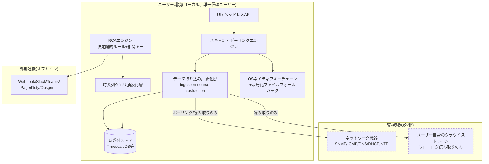

# システム方式設計書

**プロジェクト名**: (未定)
**版数**: v0.1 (ドラフト)
**位置づけ**: 要件定義書の内容を、システムレベルのアーキテクチャとして構造化・図示する文書。ロードマップ(M0-M11)への言及は含めない。
**関連文書**: [要件定義書](../要件定義書.md)（用語定義は[要件定義書 §5 用語定義](../要件定義書.md#glossary)を参照。本書独自の用語は追加しない）

---

## 0. 要件トレーサビリティ {: #traceability }

[要件定義書](../要件定義書.md)の各要件が本書のどの章に対応するかを示す。要件IDから直接ジャンプしたい場合はこの表を使う。

### 機能要件 (F-XX)

| 要件ID | 要件名 | 本書での対応箇所 |
|---|---|---|
| [F-01](../要件定義書.md#F-01) | 日本語ローカライゼーション | ⚠️ 本書に対応箇所なし |
| [F-02](../要件定義書.md#F-02) | 署名付きリリース体制 | [§3 ハードウェア構成(実行環境)](#deployment-env) — パッケージング形式 |
| [F-03](../要件定義書.md#F-03) | ICMP/SNMPポーリング | [§4 ソフトウェア構成](#software-components) — スキャン・ポーリングエンジン |
| [F-04](../要件定義書.md#F-04) | DNS検証 | [§4 ソフトウェア構成](#software-components) — スキャン・ポーリングエンジン、RCAエンジン(相関キー) |
| [F-05](../要件定義書.md#F-05) | DHCP検証 | [§4 ソフトウェア構成](#software-components) — スキャン・ポーリングエンジン、RCAエンジン(相関キー) |
| [F-06](../要件定義書.md#F-06) | NTP検証 | [§4 ソフトウェア構成](#software-components) — スキャン・ポーリングエンジン、RCAエンジン(相関キー) |
| [F-07](../要件定義書.md#F-07) | 構造化出力(JSON/Protobuf) | ⚠️ 本書に対応箇所なし |
| [F-08](../要件定義書.md#F-08) | 時系列データ書き込み抽象化 | [§4 ソフトウェア構成](#software-components) — データ取り込み抽象化層 |
| [F-09](../要件定義書.md#F-09) | 決定論的根本原因分析(RCA) | [§4 ソフトウェア構成](#software-components) — RCAエンジン |
| [F-10](../要件定義書.md#F-10) | 時系列データ読み出し抽象化 | [§4 ソフトウェア構成](#software-components) — 時系列クエリ抽象化層 |
| [F-11](../要件定義書.md#F-11) | スキャンスケジューリングモデル | [§3 ハードウェア構成](#deployment-env) — 動作形態、[§4 ソフトウェア構成](#software-components) — データ取り込み抽象化層 |

### 非機能要件 (N-XX)

| 要件ID | 分類 | 本書での対応箇所 |
|---|---|---|
| [N-01](../要件定義書.md#N-01) | プラットフォーム | [§4 ソフトウェア構成](#software-components) — UI/ヘッドレスAPI ⚠️ 差分あり(下記参照) |
| [N-02](../要件定義書.md#N-02) | 実行環境の原則 | [§2 システム全体構成](#system-overview)、[§5 ネットワーク構成](#network) |
| [N-03](../要件定義書.md#N-03) | 実装言語・技術スタック | [§3 ハードウェア構成](#deployment-env) — 実行基盤(JVM前提) |
| [N-04](../要件定義書.md#N-04) | 開発体制 | 対象外(組織・体制に関する要件のため方式設計では扱わない) |
| [N-05](../要件定義書.md#N-05) | データベース・時系列ストレージ | [§4 ソフトウェア構成](#software-components) — 時系列ストア、[§6 外部インターフェース](#external-interfaces) — 時系列バックエンド |
| [N-06](../要件定義書.md#N-06) | ローカライゼーション | ⚠️ 本書に対応箇所なし |
| [N-07](../要件定義書.md#N-07) | 保守性・拡張性(ワークスペース) | [§7 非機能要件の反映](#nfr-mapping) — ローカルアクセス制御の行 |
| [N-08](../要件定義書.md#N-08) | 認証情報・シークレット管理 | [§4 ソフトウェア構成](#software-components) — 認証情報ストア、[§6 外部インターフェース](#external-interfaces) — 認証情報アクセス |
| [N-09](../要件定義書.md#N-09) | パッケージング | [§3 ハードウェア構成](#deployment-env) |
| [N-10](../要件定義書.md#N-10) | エラーハンドリング・ロギング | ⚠️ 本書に対応箇所なし |
| [N-11](../要件定義書.md#N-11) | デーモンライフサイクル | [§3 ハードウェア構成](#deployment-env) — 動作形態(常駐デーモンモード) 部分的(ログローテーション言及なし) |
| [N-12](../要件定義書.md#N-12) | 性能・スケール目標 | ⚠️ 本書に対応箇所なし |
| [N-13](../要件定義書.md#N-13) | 対応OS | [§3 ハードウェア構成](#deployment-env) ⚠️ 差分あり(下記参照) |
| [N-14](../要件定義書.md#N-14) | ingestion-source抽象化 | [§4 ソフトウェア構成](#software-components) — データ取り込み抽象化層 |
| [N-15](../要件定義書.md#N-15) | 診断プロセスの可視性 | [§4 ソフトウェア構成](#software-components) — RCAエンジン |
| [N-16](../要件定義書.md#N-16) | データ保持・プルーニングポリシー | [§7 非機能要件の反映](#nfr-mapping) |
| [N-17](../要件定義書.md#N-17) | ローカルアクセス制御の前提 | [§7 非機能要件の反映](#nfr-mapping) |

!!! warning "トレーサビリティ整理で見つかった要確認事項"
    表を作る過程で、要件定義書と本書の間に次の差分・ギャップが見つかった。意図的な具体化であれば問題ないが、レビュー前に確認しておくことを推奨する。

    - **N-01 プラットフォーム**: 要件定義書では「本書時点では未確定」とされ、JavaFXは前提としないという含みがある。一方、本書§4は「JavaFXモードとヘッドレス/サーバーモード+Webダッシュボードの両対応」と断定的に書いている。未確定事項の具体化が本書で行われたのであれば、その旨を要件定義書側にも反映するか、本書側で「本書時点の暫定方針」と明示した方が良い。
    - **N-13 対応OS**: 要件定義書は「macOS版もリリースするが、公式テスト対象外」としているが、本書§3は「Linux・Windows・macOS(すべて正式サポート)」としており、macOSの扱いが矛盾している。
    - **F-01 / N-06 日本語ローカライゼーション**: 要件定義書で「必須」かつ「最優先の製品作業項目」とされているが、本書内に対応する記述がない。アーキテクチャレベルでは直接関係しない場合もあるが、最優先要件である以上、一言でも触れておくことを推奨する。
    - **F-07 構造化出力(JSON/Protobuf)**: 必須の機能要件だが、本書の外部インターフェース(§6)やソフトウェア構成(§4)に明記がない。
    - **N-10 エラーハンドリング・ロギング / N-12 性能・スケール目標**: いずれも要件定義書に定義があるが、本書には対応する記述がない。次工程のソフトウェア方式設計で扱うのであれば、その旨を本書に一言残しておくと、読者が「見落とし」と「意図的な先送り」を区別できる。

---

## 1. 要件の3分類 {: #req-classification }

本システムは、外部の物理ネットワーク機器・クラウド環境を**監視・診断する側**のソフトウェアであり、独自のハードウェアを必要としない。

| 分類 | 該当内容 |
|---|---|
| ソフトウェア | 本システムの全機能(スキャンエンジン、RCAエンジン、データ取り込み層、UI/APIなど) |
| ハードウェア | 該当なし(ユーザー自身が用意する汎用サーバ/PC上で動作する) |
| 手作業 | 該当なし(バックアップの実施など、要件定義書上でユーザー責任と明記した項目を除き、手作業として切り出す要件はない) |

> 手作業に分類される要件がないことは省略ではなく明示的な結論である。バックアップ・リカバリはユーザー自身の責任とする方針([要件定義書 §9 制約条件](../要件定義書.md#constraints)を参照)であり、これは「システムが実施しない手作業」ではなく「システムの責任範囲外」として扱う。

---

## 2. システム全体構成 {: #system-overview }

**設計原則(要件定義書より継承)**:
- 完全ローカル / クラウドサービス不要 / 私物利用の方式 / 読み取り専用ポリシーを徹底する。本システムからベンダークラウドへテレメトリを送信する経路は存在しない。
- クラウドテレメトリ取り込みは、ユーザー自身が管理するストレージからフローログ等を読み取るのみで、本システム側にクラウドインフラの運用責任は発生しない。
- 外部連携(通知)はすべてオプトインであり、既定では無効。

---

## 3. ハードウェア構成(実行環境) {: #deployment-env }

独自ハードウェアは存在しないため、本節は**デプロイ・実行環境要件**として扱う。

| 項目 | 内容 |
|---|---|
| 対応OS | Linux・Windows・macOS(すべて正式サポート) |
| 実行基盤 | JVM前提(v1時点ではネイティブバイナリ非対応) |
| パッケージング形式 | 署名付きJAR |
| 動作形態 | 常駐デーモンモード / one-shotモードの両対応(同一スケジューリングエンジン・同一時系列ストアを使用) |

---

## 4. ソフトウェア構成(システムレベル) {: #software-components }

内部モジュール分割(STS/TR分割など)は次工程のソフトウェア方式設計で扱う。本節ではシステムを構成する主要コンポーネントのみを列挙する。

| コンポーネント | 役割 |
|---|---|
| スキャン・ポーリングエンジン | ICMP/SNMP(v1/v3選択式)ポーリング、DNS/DHCP/NTP検証を実施 |
| データ取り込み抽象化層 | ポーリング方式(F-11)を現行実装としつつ、将来のstreaming telemetry等push型収集を再設計なしで追加可能にする |
| 時系列ストア | TimescaleDBを既定(デフォルト)バックエンドとする |
| 時系列クエリ抽象化層 | InfluxQL/PromQL/Graphite等を直接叩かず、内部クエリ抽象化層経由でアクセス。将来的な複数バックエンド対応の前提となる |
| RCAエンジン | 決定論的ルールベース。相関キー(対象識別子・タイムスタンプ・ネットワークセグメント等)によりF-04/F-05/F-06の観測データを横断的に関連付け、診断プロセスの可視性を確保する |
| UI / ヘッドレスAPI | JavaFX UIモードとヘッドレス/サーバーモード+Webダッシュボードの両対応 |
| 認証情報ストア | OSネイティブキーチェーン優先、暗号化ファイルへのフォールバック |

---

## 5. ネットワーク構成 {: #network }

**通信の方向性は明確に非対称である**:

- **アウトバウンド(本システム→外部)**: 監視対象へのポーリング(ICMP/SNMP/DNS/DHCP/NTP)、オプトイン時のみ通知連携(Webhook/Slack等)。
- **本システムが行わない通信**: ベンダークラウドサービスへのテレメトリ送信、ユーザーの同意なきデータ送信は一切存在しない。

クラウドテレメトリ取り込みは「本システムがクラウドにアクセスする」のではなく「ユーザーが自分のクラウドストレージから出力したフローログを、本システムが読み取る」形であり、本システム自体はクラウドインフラを保有・運用しない。

---

## 6. 外部インターフェース {: #external-interfaces }

| インターフェース | 方式・備考 |
|---|---|
| 通知連携 | Webhook / Slack / Teams / PagerDuty / Opsgenie(すべてオプトイン、既定で無効) |
| 時系列バックエンド | 内部クエリ抽象化層経由。マルチバックエンド対応を公に謳う前提として、TimescaleDBとPrometheus等、最低2バックエンドでの検証を条件とする |
| 認証情報アクセス | OSキーチェーンAPI |
| クラウドストレージ読み取り | ユーザー自身のAWS/Azure/GCPストレージからフローログを読み取り専用でアクセス |

---

## 7. 非機能要件のシステム方式への反映 {: #nfr-mapping }

要件定義書の非機能要件を、アーキテクチャ上の決定として明示する。

| 非機能要件(要件定義書) | システム方式設計での反映 |
|---|---|
| データ保持・プルーニング(既定90日) | 時系列ストア側のプルーニングポリシーとして実装。時系列クエリ抽象化層はプルーニング後のデータ欠落を前提に設計する |
| ローカルアクセス制御(v1は単一信頼ユーザー・認証機構なし) | システム全体構成において、複数ユーザー・RBACを前提としたコンポーネント分離は行わない。ただしデータモデルは将来のワークスペース概念に対応できるよう内部的に開いておく |
| バックアップ・リカバリはユーザー責任 | システムはバックアップ機構を持たない。データ配置(TimescaleDBのデータディレクトリ等)を明確にドキュメント化することで、ユーザーが自身の手段でバックアップを行えるようにする |
| 完全ローカル / クラウドサービス不要 / 私物利用の方式 / 読み取り専用ポリシー | 本書[2節](#system-overview)・[5節](#network)のアーキテクチャ図・通信方向性として明示 |

---

## 未確定事項 {: #open-issues }

!!! note "未確定事項"
    - Spring Boot対応の範囲(M7のWeb/APIシェルのみか、コアロジックにも及ぶか)は未決定であり、本書では反映していない。要件の洗い出しブレインストーミング後に改訂する。
    - 上記[§0 トレーサビリティ](#traceability)の警告欄も参照(N-01プラットフォーム確定方針、N-13 macOSサポートレベルの整合性確認が必要)。