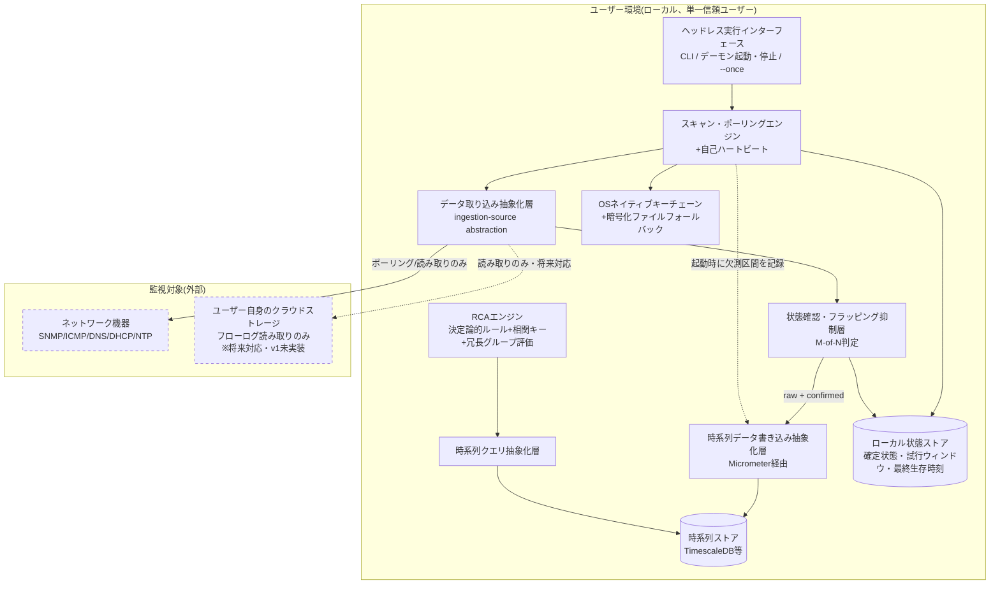

--8<-- "glossary.md"

# システム方式設計書

**プロジェクト名**: (未定)
**版数**: v0.5 (ドラフト)
**位置づけ**: 要件定義書の内容を、システムレベルのアーキテクチャとして構造化・図示する文書。
**関連文書**: [要件定義書](../要件定義書.md)（用語定義は[要件定義書 §5 用語定義](../要件定義書.md#glossary)を参照。本書独自の用語は追加しない）。要件と本書各章との対応は[トレーサビリティ](../トレーサビリティ.md)を参照(本書は個別の対応表を持たない)

| 改訂日 | バージョン | 変更内容 |
|---|---|---|
| 2026-09-19 | v0.1 | 初版作成。トレーサビリティ表(§0)を作成する過程で、要件定義書との差分・ギャップ(N-01のプラットフォーム方針、N-13のmacOS扱い、F-01/F-07/N-10/N-12の記述欠落等)を警告欄にまとめて記録。 |
| 2026-09-19 | v0.2 | §0の警告欄で指摘した差分を本文に反映して整理。F-01/N-06を「対象外」として明記、F-07(構造化出力)・N-10(エラーハンドリング)・N-12(性能目標)に対応箇所を追加。F-12(状態遷移確認ロジック)・F-13(冗長グループ)・N-18(自己死活監視)・N-19(再起動後の再開性)をソフトウェア構成・非機能要件反映(§4/§7)に追加し、状態確認・フラッピング抑制層(M-of-N判定)をコンポーネントとして新設。N-13のmacOS表記を要件定義書と一致させた。 |
| 2026-09-19 | v0.3 | 通知・アラート機能、可視化・ダッシュボードUI、履歴調査UI等をv1スコープ外として明記し、本書の構成(図・外部インターフェース)から除外(要件定義書§8のスコープ整理に追随)。クラウドテレメトリ取り込みを「将来対応・v1未実装」と明示。UI/ヘッドレスAPIを「ヘッドレス実行インターフェース」に改称し、v1はヘッドレス運用を前提とする方針を確定。N-03にJava 26を明記。F-09/F-10の提供時期(初期リリース安定後)に関する設計原則の適用を追加。 |
| 2026-09-19 | v0.4 | 要件定義書v0.8との整合を取り、F-08の書き込み抽象化(Micrometer)を独立コンポーネントとして分離、F-09のRCAエンジン説明に「ソース間不一致」の扱いを追加、N-01のヘッドレス前提を本書独自の先行決定として未確定事項に明記。改訂履歴表を新設(旧版v0.1/v0.2からの変更点を遡って記録)。 |
| 2026-09-19 | v0.5 | ドキュメント基盤の整理(内容変更なし)。旧§0 要件トレーサビリティを削除し、全ドキュメント共通の独立ページ[トレーサビリティ](../トレーサビリティ.md)に置き換えた。要件ID(F-XX/N-XX)のホバーツールチップ用語集を導入。§7のN-19行にあった§0警告欄への参照を、新トレーサビリティページへの参照に更新。 |
---

## 1. 要件の3分類 {: #req-classification }

本システムは、外部の物理ネットワーク機器・クラウド環境を**監視・診断する側**のソフトウェアであり、独自のハードウェアを必要としない。

| 分類 | 該当内容 |
|---|---|
| ソフトウェア | 本システムの全機能(スキャンエンジン、RCAエンジン、データ取り込み層、UI/APIなど) |
| ハードウェア | 該当なし(ユーザー自身が用意する汎用サーバ/PC上で動作する) |
| 手作業 | 該当なし(バックアップの実施など、要件定義書上でユーザー責任と明記した項目を除き、手作業として切り出す要件はない) |

> 手作業に分類される要件がないことは省略ではなく明示的な結論である。バックアップ・リカバリはユーザー自身の責任とする方針([要件定義書 §9 制約条件](../要件定義書.md#constraints)を参照)であり、これは「システムが実施しない手作業」ではなく「システムの責任範囲外」として扱う。

---

## 2. システム全体構成 {: #system-overview }

**設計原則(要件定義書より継承)**:
- 完全ローカル / クラウドサービス不要 / 私物利用の方式 / 読み取り専用ポリシーを徹底する。本システムからベンダークラウドへテレメトリを送信する経路は存在しない。
- クラウドテレメトリ取り込み(将来対応・v1未実装。要件定義書N-02)は、ユーザー自身が管理するストレージからフローログ等を読み取るのみで、本システム側にクラウドインフラの運用責任は発生しない。
- 通知・アラート機能は要件定義書§8のとおりv1スコープ外であり、本書の構成には含めない。将来追加する場合も、既定では無効・オプトインとする。

---

## 3. ハードウェア構成(実行環境) {: #deployment-env }

独自ハードウェアは存在しないため、本節は**デプロイ・実行環境要件**として扱う。

| 項目 | 内容 |
|---|---|
| 対応OS | Linux・Windowsを公式サポート対象とする。macOS版もリリースするが、公式テスト対象外とする(要件定義書N-13と一致) |
| 実行基盤 | JVM前提(Java 26、ビルドはGradle。v1時点ではネイティブバイナリ非対応) |
| パッケージング形式 | 署名付きJAR |
| 動作形態 | 常駐デーモンモード / one-shotモードの両対応(同一スケジューリングエンジン・同一時系列ストアを使用) |

---

## 4. ソフトウェア構成(システムレベル) {: #software-components }

内部モジュール分割(STS/TR分割など)は次工程のソフトウェア方式設計で扱う。本節ではシステムを構成する主要コンポーネントのみを列挙する。

| コンポーネント | 役割 |
|---|---|
| スキャン・ポーリングエンジン | ICMP/SNMP(v1/v3選択式)ポーリング、DNS/DHCP/NTP検証を実施。自身のスケジューリングループについてハートビートを出力し、外部からツール自体の停滞・ハングを検知可能にする(N-18) |
| 状態確認・フラッピング抑制層 | F-04/F-05/F-06の生の試行結果(raw)を受け取り、M回中N回の失敗で初めて状態遷移とみなすM-of-N判定を行う。確定状態(confirmed)を算出してもrawは破棄せず、両方を後段(データ取り込み抽象化層・RCAエンジン)へ渡す(F-12) |
| データ取り込み抽象化層 | 収集方式(ポーリング(F-11)か、将来のstreaming telemetry等push型か)を抽象化する層。現行実装はポーリングのみだが、収集方式を切り替えても後段(状態確認・フラッピング抑制層以降)の再設計を不要にする(N-14)。時系列ストアへの書き込み経路は含まない(書き込みは時系列データ書き込み抽象化層が担う) |
| 時系列データ書き込み抽象化層 | Micrometer経由で時系列データ(raw + confirmed)を時系列ストアへ書き込み、特定バックエンドの実装に直結させない(F-08)。状態確認・フラッピング抑制層からの出力を受け取り、時系列ストアへ渡す唯一の経路とする。N-05が求める「最低2バックエンドでの書き込み抽象化層の検証」の対象となる |
| 時系列ストア | TimescaleDBを既定(デフォルト)バックエンドとする |
| 時系列クエリ抽象化層 | InfluxQL/PromQL等を直接叩かず、内部クエリ抽象化層経由でアクセス。将来的な複数バックエンド対応の前提となる |
| RCAエンジン | 決定論的ルールベース。相関キー(対象識別子・タイムスタンプ・ネットワークセグメント等)によりF-04/F-05/F-06の観測データ(confirmed state)を横断的に関連付け、診断プロセスの可視性を確保する。同一対象・近接時間帯でチェック間の結果が食い違う場合(例: SNMPではdownだがICMPは到達可能)は「ソース間不一致」として単独の所見に加え、RCAの検討対象とする(F-09)。ユーザーが宣言した冗長グループ(F-13)内で片系のみ障害の場合は「縮退」として判定し、組み込みルールの結論を上書き・抑制しないadditive方式とする |
| ヘッドレス実行インターフェース | v1はヘッドレス(サーバー)運用を前提とし、常駐デーモンモード/one-shotモード(`--once`)の起動・停止と、構造化出力(F-07)の取得を提供する。要件定義書N-01(v1はヘッドレス運用)に基づく。JavaFX UIおよびWebダッシュボードは要件定義書§8のとおりv1スコープ外(将来は自己ホスト前提で検討)であり、本書の構成には含めない。ネットワーク越しのAPI/Webを将来提供する場合は認証機構の追加が必要になる(N-17) |
| 認証情報ストア | OSネイティブキーチェーン優先、暗号化ファイルへのフォールバック |
| ローカル状態ストア | OSネイティブキーチェーン優先、暗号化ファイルへのフォールバック |

**設計原則の適用**:
- **提供順序(F-09/F-10)**: RCAエンジン(F-09)と時系列クエリ抽象化層(F-10)は差別化要素の中核として本方式設計に含めるが、要件定義書上は初期リリース安定後の提供(F-09は推奨、F-10は同時期)であり、v1完成基準(要件定義書§10)には含まれない。v1で先行して満たすのは、相関キーを含む観測データの記録(F-04〜F-06)と、raw/confirmedの構造化出力・時系列蓄積(F-07/F-08/F-12)まで
- **エラーハンドリング(N-10)**: 対象到達不能等のエラーは、いずれのチェック・診断コンポーネント(スキャン・ポーリングエンジン、状態確認・フラッピング抑制層、RCAエンジン等)においても例外として握りつぶさず、構造化された「到達不能」結果として返す。この原則はシステムを構成するすべてのコンポーネントに一律適用する。ログの具体的な出力形式・ローテーション方式はソフトウェア方式設計で定める
- **性能・スケール目標(N-12)**: 初期目標(数百ホスト規模・設定可能なポーリング間隔)は、pluggableな時系列ストア(TimescaleDB, 本節)と単一プロセスのスケジューリングエンジン(§3)を前提として成立させる。具体的なベンチマーク数値は本書時点では未確定であり、実装後の実測を踏まえて見直す

---

## 5. ネットワーク構成 {: #network }

**通信の方向性は明確に非対称である**:

- **アウトバウンド(本システム→外部)**: 監視対象へのポーリング(ICMP/SNMP/DNS/DHCP/NTP)。通知連携はv1スコープ外(要件定義書§8)。
- **本システムが行わない通信**: ベンダークラウドサービスへのテレメトリ送信、ユーザーの同意なきデータ送信は一切存在しない。

クラウドテレメトリ取り込み(将来対応)は「本システムがクラウドにアクセスする」のではなく「ユーザーが自分のクラウドストレージから出力したフローログを、本システムが読み取る」形であり、本システム自体はクラウドインフラを保有・運用しない。

---

## 6. 外部インターフェース {: #external-interfaces }

| インターフェース | 方式・備考 |
|---|---|
| 構造化出力 | チェック結果・RCA結果はJSON/Protobufによる構造化形式で出力する(F-07)。ヘッドレス実行インターフェース、および将来追加する外部連携(可視化・通知等、v1スコープ外)は、いずれもこの構造化データを共通の入力として消費する |
| 通知連携 | v1スコープ外(要件定義書§8)。将来追加する場合はWebhook / Slack / Teams / PagerDuty / Opsgenie等を想定し、既定で無効・オプトインとする |
| 時系列バックエンド | 内部クエリ抽象化層経由。マルチバックエンド対応を公に謳う前提として、TimescaleDBとPrometheus等、最低2バックエンドでの検証を条件とする |
| 認証情報アクセス | OSキーチェーンAPI |
| クラウドストレージ読み取り | 将来対応(v1未実装。要件定義書N-02)。ユーザー自身のAWS/Azure/GCPストレージからフローログを読み取り専用でアクセス |

---

## 7. 非機能要件のシステム方式への反映 {: #nfr-mapping }

要件定義書の非機能要件を、アーキテクチャ上の決定として明示する。

| 非機能要件(要件定義書) | システム方式設計での反映 |
|---|---|
| データ保持・プルーニング(既定90日) | 時系列ストア側のプルーニングポリシーとして実装。時系列クエリ抽象化層はプルーニング後のデータ欠落を前提に設計する |
| ローカルアクセス制御(v1は単一信頼ユーザー・認証機構なし) | システム全体構成において、複数ユーザー・RBACを前提としたコンポーネント分離は行わない。ただしデータモデルは将来のワークスペース概念に対応できるよう内部的に開いておく |
| バックアップ・リカバリはユーザー責任 | システムはバックアップ機構を持たない。データ配置(TimescaleDBのデータディレクトリ、ローカル状態ストアの配置場所等)を明確にドキュメント化することで、ユーザーが自身の手段でバックアップを行えるようにする |
| 自己死活監視(N-18) | スキャン・ポーリングエンジンがハートビートを出力する([§4](#software-components))。ハートビートの受信・監視方法(自己プロセス内チェックか、外部エージェント連携か)は本書時点では未決定 |
| 再起動後の再開性(N-19) | クラッシュ・再起動後もスケジュールと直近の確定状態(F-12)を失わない設計とする。運用状態は時系列ストアとは別の専用ローカル状態ストア[§4](#software-components)に保持し、観測履歴とライフサイクルを分離する(v1にはF-10の読み出し経路がないため、状態の復元を時系列ストア経由にはしない)。停止期間は「欠測」として時系列ストアに記録し、RCAには障害として渡さない |
| 完全ローカル / クラウドサービス不要 / 私物利用の方式 / 読み取り専用ポリシー | 本書[2節](#system-overview)・[5節](#network)のアーキテクチャ図・通信方向性として明示 |

---

## 未確定事項 {: #open-issues }

!!! note "未確定事項"
    - Web/APIシェルを将来提供する場合のフレームワーク(Spring Boot等)の採否と適用範囲(シェルのみか、コアロジックにも及ぶか)は未決定。Web/APIシェル自体がv1スコープ外(要件定義書§8)のため、v1の構成には反映していない。