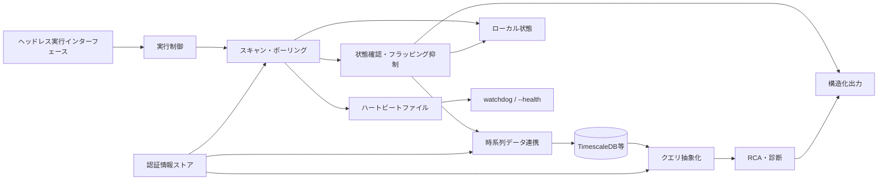
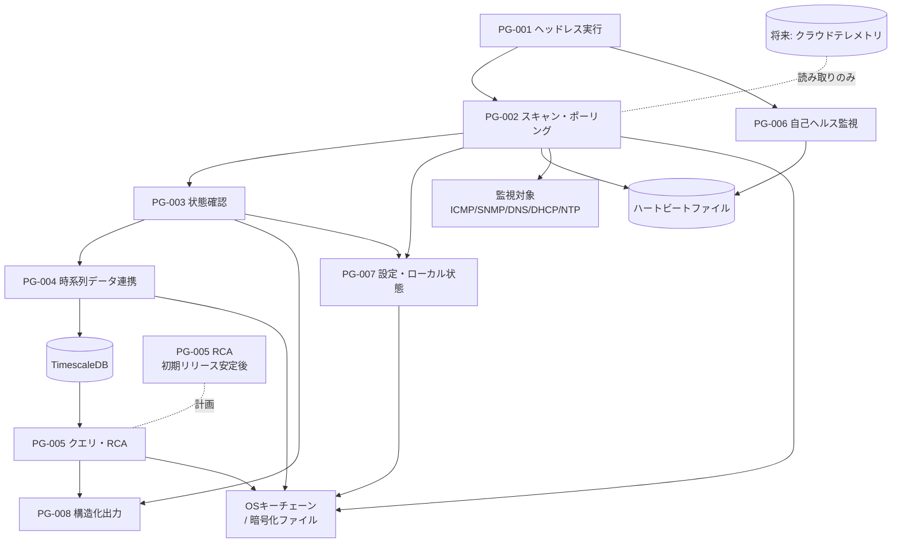
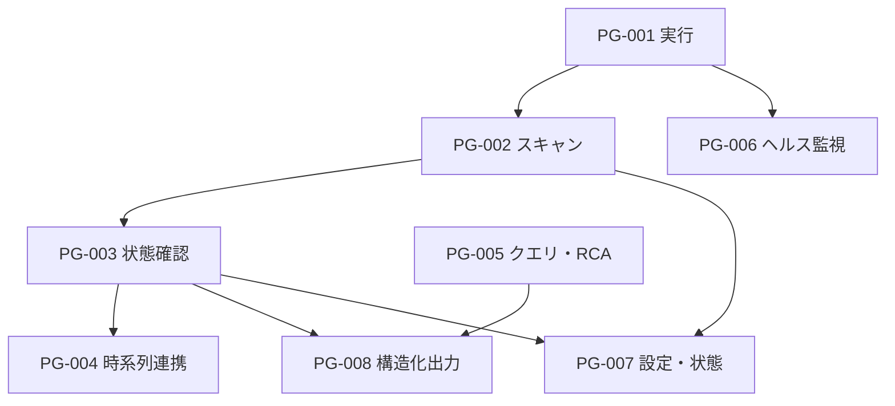
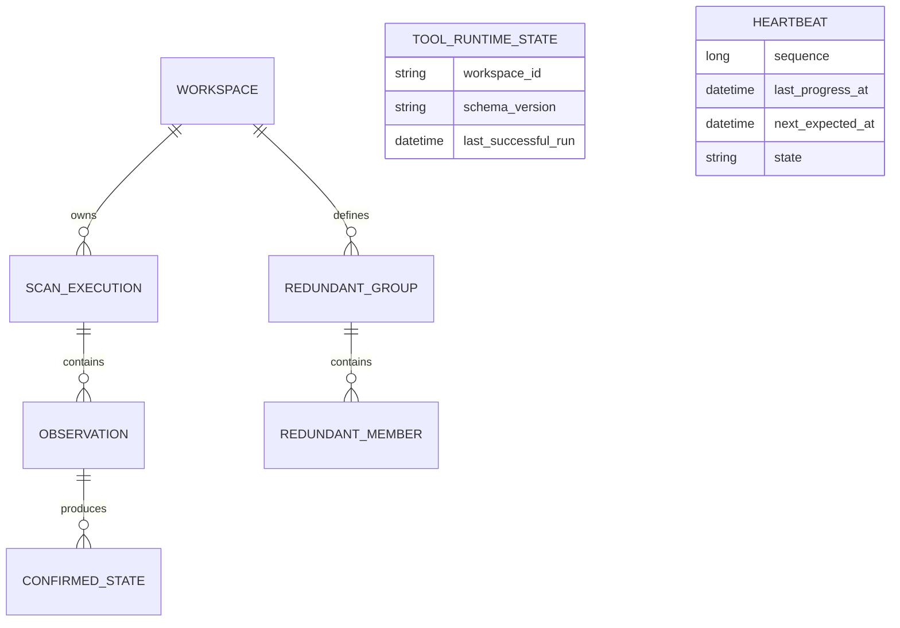
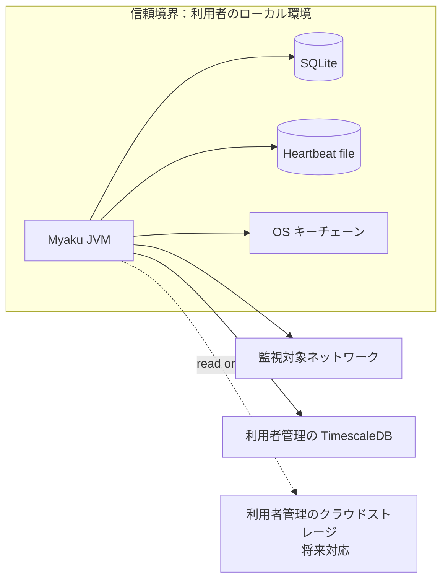

# ソフトウェア方式設計書

> **本書の位置づけ**: 要件定義書およびシステム方式設計書で定めた内容を、プログラムの単位まで具体化し、実装開始前にアーキテクチャ上の主要判断を確定する。
>
> **設計上の前提**: 現時点のリポジトリは Gradle の Java ライブラリ初期構成を基礎としている。本書では v1 に必要なプログラム責務、データ保持方式、並行実行、障害時挙動、セキュリティ境界等を確定し、クラス・パッケージ等のモジュzール内部構造のみを後続のソフトウェア詳細設計書へ委譲する。

---

## 0. 文書管理

### 0.1 文書情報

| 項目 | 内容 |
|---|---|
| 文書ID | SAD-MYAKU-001 |
| 文書名 | ソフトウェア方式設計書 |
| プロジェクト名 | Myaku（脈） |
| システム名 / サブシステム名 | ネットワークヘルスチェック / Myaku |
| 現行バージョン | 0.1 |
| ステータス | ドラフト |
| 最終更新日 | 2026-10-03 |
| 作成者 | 春霞 |
| 保管場所 | GitHub: `Haruyuzuriha/Myaku` / `docs/docs/システム設計/ソフトウェア方式設計.md` |
| 入力となる文書 | システム方式設計書 v0.6、要件定義書 v1.0 |

### 0.2 バージョン採番ルール

| 種別 | 形式 | 使う場面 |
|---|---|---|
| メジャー | X.0 | プログラム構成・機能割付・方式の変更など、詳細設計や実装に影響する改訂 |
| マイナー | X.Y | 誤記修正、表現の明確化、補足追加など、設計内容に影響しない改訂 |
| ドラフト | 0.Z | 初回承認前の作成・レビュー段階（承認時に 1.0 とする） |

### 0.3 改版履歴

| Ver. | 改版日 | 改版者 | 変更箇所（章・プログラムID） | 変更内容・理由 | 変更要求番号 | 承認者 |
|---|---|---|---|---|---|---|
| 0.1 | 2026-10-03 | 春霞 | 全体 | 初版作成。要件定義書 v1.0 とシステム方式設計書 v0.6 をプログラム単位へ展開 | - | - |
| 0.2 | 2026-10-03 | 春霞 | §2, §4, §6～§10, §13 | セキュリティ・運用・並行実行・障害復旧を具体化し、heartbeat とローカル状態ストアの方式を確定。設計上の不整合を修正 | - | - |
| 0.3 | 2026-10-03 | 春霞 | §2, §6～§10, §13, 付録A/B | SQLite の責務範囲、リカバリ・破損時方針、scan-cycle transaction、single-instance guard、JDK 26 / sqlite-jdbc の native access と署名 JAR 配布方式を確定。設定・secret・heartbeat を SQLite 外へ分離 | - | - |

### 0.4 レビュー・承認記録

| Ver. | 役割 | 氏名 | 所属 | 実施日 | 結果 | コメント |
|---|---|---|---|---|---|---|
| 0.1 | 作成 | 春霞 | 個人開発 | 2026-10-03 | - | 初版 |
| 0.1 | レビュー | 未実施 | - | - | - | - |
| 0.1 | 承認 | 未承認 | - | - | - | - |

### 0.5 配布先

| 氏名 | 所属 | 配布Ver. | 配布日 |
|---|---|---|---|
| 春霞 | 個人開発 | 0.1 | 2026-10-03 |

---

## 1. はじめに

### 1.1 目的

本書は、要件定義書およびシステム方式設計書で定義した Myaku のソフトウェア構成を、プログラム単位の役割・責務・実行形態・インタフェース・共通方式まで具体化し、ソフトウェア詳細設計および実装の入力とすることを目的とする。

### 1.2 適用範囲

本書の対象は、Java/JVM 上で動作する Myaku 本体と、その内部で動作するスキャン、状態確認、データ連携、構造化出力、自己死活監視、ローカル状態管理等のソフトウェア処理である。

以下は本書の v1 対象外とする。

- GUI（JavaFX）
- Web ダッシュボード
- Webhook / Slack / Teams / PagerDuty / Opsgenie 等の通知連携
- ユーザーのインフラへの設定変更・修復実行
- クラウドテレメトリ取り込み（将来対応）
- 分散ワーカー構成
- AI による能動的な検知・診断

### 1.3 想定読者

開発者、レビュー担当者、単体・結合テスト担当者、将来の保守担当者を想定する。

### 1.4 用語定義

| 用語 | 定義 |
|---|---|
| プログラム | 独立して実行、または他のプログラムから呼び出される処理のまとまり。本書では JVM 内の論理的な責務単位を指す |
| raw | ポーリング／検証で得た個々の試行結果。状態確認前の生データ |
| confirmed | M-of-N 判定後の確定状態 |
| 欠測 | ツール停止・クラッシュ・スケジューラ停滞等により観測できなかった期間 |
| schema_version | 構造化出力または永続データのスキーマ互換性を判定するバージョン情報 |

### 1.5 参照文書

| 文書ID | 文書名 | Ver. | 備考 |
|---|---|---|---|
| REQ-MYAKU-001 | 要件定義書 | 1.0 | 上位要件 |
| SYS-MYAKU-001 | システム方式設計書 | 0.6 | システムレベル設計 |
| TR-MYAKU-001 | トレーサビリティ | 最新版 | 要件と設計文書の対応 |

---

## 2. 設計方針

### 2.1 基本方針

Myaku は単一の Java/JVM プロセスを基本単位とし、その内部を責務ごとの論理プログラムへ分割する。

基本処理は次の流れとする。

設計上の優先事項は以下とする。

1. **完全ローカル / クラウドサービス不要 / 利用者の環境持ち込み方式 / 読み取り専用ポリシー**を維持する。
2. 収集方式・時系列バックエンド・クエリ方式を抽象化し、後続拡張時にコア処理を作り直さない。
3. 診断結果は決定論的に再現可能とし、参照した観測データ・相関関係・適用ルールを追跡可能にする。
4. 対象到達不能等の失敗は例外を握りつぶさず、構造化された結果として扱う。
5. ツール自身のヘルス状態は時系列ストアから独立させ、ハートビートファイルを一次判定元とする。
6. **単一スケジューラ + 仮想スレッドによるチェック並列実行**を採用し、監視対象への負荷は設定可能な同時実行数で制限する。各チェックには個別 timeout を設け、1 件のハングがスケジューラ全体を永久に停止させない。
7. 観測結果の受け渡しは **bounded queue** を用いる。キュー満杯時は観測結果を破棄せずバックプレッシャーを発生させ、構造化ログに `storage_backpressure` を記録する。これにより「データを黙って落とす」挙動を避ける。
8. heartbeat のファイル更新は同一ディレクトリ内の一時ファイルへ完全な内容を書き出した後、`ATOMIC_MOVE` を優先した rename で置換する。非対応ファイルシステムでは通常の置換へフォールバックし、読み手が不完全なレコードを取得しないようにする。
9. **設定と runtime state を分離**する。冗長グループ定義を含む利用者設定は version-control-friendly なテキスト設定ファイルで管理し、SQLite には runtime state のみを保存する。
10. **single-instance guard** をデーモン / one-shot の共通起動経路へ適用し、同じ runtime state を 2 プロセスが同時更新しないようにする。`--health` はロックを取得せず、heartbeat を読むだけとする。

### 2.2 採用技術・開発環境

| 区分 | 内容 | Ver. | 選定理由 |
|---|---|---|---|
| 言語 | Java | 26 | 要件定義書 N-03 |
| ビルド | Gradle Wrapper | 9.7.1 | リポジトリで固定して再現可能なビルドを行う |
| JVM | Java toolchain | 26 | OS に依存しない Java 実行基盤 |
| 並行実行 | Java 仮想スレッド + bounded Executor | JDK 26 | 数百ホスト規模の I/O 待ちを効率よく並列化し、同時実行数を制御する |
| ローカル状態 DB | SQLite 3 + Xerial JDBC driver | 固定方式 | 単一プロセスの runtime state に十分な transaction / WAL / integrity check を提供。v1 では外部 DB サーバーを要求しない |
| 時系列データ書き込み | Micrometer 経由 | 要件準拠 | F-08 の書き込み抽象化 |
| 時系列バックエンド | TimescaleDB | デフォルト | N-05 の主要バックエンド |
| 構造化出力 | JSON / Protobuf | 要件準拠 | F-07 |
| 永続ローカル状態 | SQLite 3 の単一ファイル DB（WAL、`synchronous=FULL`） | 固定 | N-19 の再起動後再開性と、scan-cycle 単位の原子的な状態更新 |
| 認証情報 | OS ネイティブキーチェーン、必要時は暗号化ファイルへフォールバック | OS依存 | N-08 |

### 2.3 前提条件・制約条件

| No. | 区分 | 内容 |
|---|---|---|
| 1 | 技術 | JVM 上で動作し、v1 は Java 26 を対象とする |
| 2 | 実行形態 | v1 は GUI を持たず、CLI / デーモン / one-shot を基本とする |
| 3 | ネットワーク | 監視対象への通信は読み取り・検証目的に限定する |
| 4 | データ | 時系列データの既定保持期間は 90 日とする |
| 5 | 認証 | v1 は単一の信頼されたローカルユーザーを前提とし、アプリ独自の認証機構は設けない |
| 6 | RCA | F-09 / F-10 は初期リリース安定後の提供対象であり、v1 完成基準には含めない |

---

## 3. 設計ID採番・管理ルール

### 3.1 ID体系

| 種別 | 接頭辞 | 例 |
|---|---|---|
| プログラム | PG | PG-001 |
| プログラム間インタフェース | PI | PI-001 |
| 共通処理 | CM | CM-001 |
| 方式（非機能の実現方式） | AR | AR-001 |
| 外部インタフェース | IF | IF-001 |

一度採番した ID は再利用しない。削除する場合はステータスを「削除」とし、履歴を残す。

### 3.2 ステータス

| ステータス | 意味 |
|---|---|
| 起案 | 作成中 |
| 合意 | 関係者で合意済み |
| 承認 | 本書の承認とともに確定 |
| 変更中 | 変更要求が進行中 |
| 削除 | 設計として取り下げ（履歴保持） |

---

## 4. ソフトウェア構成

### 4.1 ソフトウェア全体構成図

### 4.2 プログラム一覧

| プログラムID | プログラム名 | 種別 | 概要 | 実行形態 | ステータス | 追加Ver. | 最終変更Ver. |
|---|---|---|---|---|---|---|---|
| PG-001 | ヘッドレス実行プログラム | 共通 / 制御 | CLI から常駐・one-shot・health 等の実行モードを受け付け、処理系を起動する | オンライン / 常駐 / one-shot | 起案 | 0.1 | 0.1 |
| PG-002 | スキャン・ポーリングプログラム | バッチ / 常駐 | ICMP/SNMP/DNS/DHCP/NTP の観測を行い、スケジューラループを進行させる | 常駐 / one-shot | 起案 | 0.1 | 0.1 |
| PG-003 | 状態確認プログラム | 共通 / 業務ロジック | raw 結果から M-of-N 判定を行い、confirmed 状態とフラッピング抑制結果を生成する | オンライン | 起案 | 0.1 | 0.1 |
| PG-004 | 時系列データ連携プログラム | 共通 / データ連携 | Micrometer を介して raw / confirmed / tool.heartbeat を時系列バックエンドへ出力する | オンライン / 非同期 | 起案 | 0.1 | 0.1 |
| PG-005 | クエリ・RCAプログラム | 共通 / 業務ロジック | 内部クエリ抽象化を介した観測取得と、決定論的 RCA を行う。初期リリース安定後に提供 | オンライン | 起案 | 0.1 | 0.1 |
| PG-006 | 自己ヘルス監視プログラム | 共通 / バッチ | ハートビートの停滞を監視し、`--health` の状態判定を行う | 常駐 / one-shot | 起案 | 0.1 | 0.1 |
| PG-007 | 設定・ローカル状態管理プログラム | 共通 / データ管理 | 設定、確定状態、試行ウィンドウ、再開状態等を管理する | オンライン | 起案 | 0.1 | 0.1 |
| PG-008 | 構造化出力プログラム | 共通 / 出力 | JSON / Protobuf による機械可読な出力を生成する | オンライン / one-shot | 起案 | 0.1 | 0.1 |

### 4.3 プログラム構成図

PG-006 は heartbeat をファイルから読み取るだけであり、PG-007 とのプログラム間インタフェースを持たない。

---

## 5. 機能割付（要件 → プログラム）

本版では、まだ独立したソフトウェア要件定義書の要件 ID が確定していないため、要件定義書の F-XX / N-XX を上位要件 ID として直接継承する。

### 5.1 ソフトウェア要件とプログラムの対応

| 要件ID | 要件名 | 割付先プログラムID | 割付内容・備考 |
|---|---|---|---|
| F-01 | 日本語ローカライゼーション | PG-001, PG-008 | CLI メッセージ、エラーメッセージ、構造化出力以外の利用者向け文言を日本語化 |
| F-02 | 署名付きリリース体制 | プログラム外（CI/CD） | 署名付き JAR をリリース成果物とする。署名処理は CI / リリース工程で実施し、PG-001 の実行責務には含めない |
| F-03 | ICMP/SNMPポーリング | PG-002 | ICMP および SNMP v1/v3 の取得方式を収集アダプタとして実装 |
| F-04 | DNS検証 | PG-002, PG-003 | 問い合わせ・結果分類は PG-002、確認状態は PG-003 |
| F-05 | DHCP検証 | PG-002, PG-003 | DHCPDISCOVER / DHCPOFFER 生存確認 |
| F-06 | NTP検証 | PG-002, PG-003 | オフセット測定とドリフト閾値判定 |
| F-07 | 構造化出力 | PG-008 | JSON / Protobuf、`schema_version` を含む |
| F-08 | 時系列データ書き込み抽象化 | PG-004 | Micrometer 経由でバックエンド非依存に出力 |
| F-09 | 決定論的RCA | PG-005 | ルール / 相関キー / 冗長グループを用いた RCA。初期リリース安定後 |
| F-10 | 時系列データ読み出し抽象化 | PG-005 | 内部クエリ抽象化層を介して時系列ストアへアクセス |
| F-11 | スキャンスケジューリングモデル | PG-001, PG-002 | 常駐 / one-shot を同一スケジューリングエンジンで実現 |
| F-12 | 状態遷移の確認ロジック | PG-003 | M-of-N、フラッピング抑制、raw / confirmed 併存 |
| F-13 | 冗長グループの宣言 | PG-005, PG-007 | グループ定義は PG-007、評価は PG-005。既存ルールへの additive 方式 |
| N-01 | ヘッドレス運用 | PG-001, PG-006, PG-008 | v1 は CLI / デーモン / one-shot / `--health` |
| N-03 | Java 26 / Gradle | PG-001～PG-008 | JVM / Gradle に統一 |
| N-05 | TimescaleDB・pluggable storage | PG-004, PG-005 | 書き込み・読み出しを抽象化 |
| N-08 | シークレット管理 | PG-002, PG-004, PG-005, PG-007 | OS キーチェーン優先 |
| N-10 | エラー処理・構造化ログ | PG-001～PG-008 | 共通処理で統一 |
| N-11 | デーモンライフサイクル | PG-001, PG-006 | 起動・停止・長期稼働 |
| N-12 | 数百ホスト規模 | PG-002, PG-004 | 単一プロセスと非同期連携を前提とした初期目標 |
| N-14 | ingestion-source 抽象化 | PG-002 | ポーリングを現在の実装とし、将来の push 方式を追加可能にする |
| N-15 | 診断プロセスの可視性 | PG-005, PG-008 | 観測データ・関係性・ルールを構造化して出力 |
| N-16 | データ保持・プルーニング | PG-004 | TSDB 側の保持・削除ポリシーを利用 |
| N-17 | ローカルアクセス制御 | PG-001, PG-007 | 単一信頼ユーザー前提、アプリ内認証なし |
| N-18 | 自己死活監視 | PG-002, PG-006, PG-004 | スケジューラ進捗を heartbeat に反映し、`tool.heartbeat` は非同期・ベストエフォート |
| N-19 | 再起動後の再開性 | PG-002, PG-003, PG-007 | ローカル状態から試行ウィンドウ・確定状態等を復元 |

---

## 6. プログラム設計

### 6.1 プログラム概要

#### PG-001 ヘッドレス実行プログラム

| 項目 | 内容 |
|---|---|
| 概要・役割 | CLI の入力を解釈し、常駐デーモン、one-shot、`--health` 等の処理モードを起動する |
| 実現する要件 | F-11, F-07, N-01, N-03, N-11, N-17 |
| 起動契機 | ユーザー操作 / 外部スケジューラ |
| 入力 | CLI 引数、設定ファイル、環境情報 |
| 出力 | プログラム終了コード、構造化出力、ログ |
| 主な処理の流れ | 引数解析 → 設定読込 → モード判定 → 対応プログラム起動 → 終了処理 |
| 使用するデータ | 設定、ローカル状態、認証情報 |
| 呼び出すプログラム / 呼び出し元 | PG-002, PG-006 / 外部CLI |
| 例外・エラー時の動作 | 引数不正・設定不正は即時終了。実行中の対象エラーは構造化結果へ変換 |
| 備考 | v1 はネットワーク越し API を持たない |

#### PG-002 スキャン・ポーリングプログラム

| 項目 | 内容 |
|---|---|
| 概要・役割 | 設定された対象に対して ICMP/SNMP/DNS/DHCP/NTP の観測を並列実行し、1 周期のスケジュール進行を管理する |
| 実現する要件 | F-03～F-06, F-11, N-10, N-12, N-14, N-18, N-19 |
| 起動契機 | PG-001 からの起動、スケジュール時刻 |
| 入力 | 対象定義、チェック設定、認証情報 |
| 出力 | raw 観測結果、周期進捗、heartbeat 更新情報 |
| 主な処理の流れ | 周期開始 → 対象ごとのチェックタスク生成 → 仮想スレッドで並列実行 → per-check timeout / retry → 結果収集 → PG-003 へ送信 → 次回周期を計算 → heartbeat 更新 → 周期完了 |
| 並行実行方式 | 単一 scheduler thread が周期を管理し、I/O 待ちのチェックは仮想スレッドへ投入する。`max_concurrent_checks` の Semaphore で同時実行数を制限する |
| タイムアウト | デフォルト 3 秒。DHCP のみ 5 秒。設定で変更可能 |
| リトライ | timeout / transport error に限り 1 回、250ms 後に再試行。NXDOMAIN、SERVFAIL、期待値不一致等の意味的結果は原則再試行しない |
| 周期の過負荷 | チェックの完了を待たずに次周期へ重複実行しない。同一対象の未完了タスクは次周期へ持ち越さず、timeout 後に結果を確定する |
| シャットダウン | 新規タスク投入を停止 → 実行中タスクへ cancellation → grace period 5 秒待機 → 残留タスクを interrupt → 状態保存 → heartbeat を stopped に更新して終了 |
| 使用するデータ | 設定、認証情報、実行状態、heartbeat |
| 呼び出すプログラム / 呼び出し元 | PG-003, PG-007, PG-004 / PG-001 |
| 例外・エラー時の動作 | 対象側の失敗は構造化結果へ変換し、1 件の失敗で他対象のチェックを停止させない |
| 備考 | heartbeat の「進捗」は、**スケジューラがその周期の結果を確定し、次回周期を決定できたこと**を主要な進捗とする。各周期終了時に `sequence` を増加させる。個々のチェック完了だけでは heartbeat を更新しない |

#### PG-003 状態確認プログラム

| 項目 | 内容 |
|---|---|
| 概要・役割 | raw 試行結果を M-of-N ルールへ入力し、confirmed 状態とフラッピング抑制結果を生成する |
| 実現する要件 | F-12, N-10, N-19 |
| 起動契機 | PG-002 からの raw 結果受信 |
| 入力 | raw 結果、過去の試行ウィンドウ、確認設定 |
| 出力 | raw + confirmed、状態遷移情報 |
| 主な処理の流れ | raw 受信 → 試行ウィンドウ更新 → M-of-N 判定 → confirmed 更新 → PG-004 / PG-008 / PG-007 へ渡す |
| 使用するデータ | 試行ウィンドウ、confirmed state |
| 呼び出すプログラム / 呼び出し元 | PG-004, PG-007, PG-008 / PG-002 |
| 例外・エラー時の動作 | 状態計算不能時はエラー状態として記録し、直前状態を暗黙に成功扱いしない |
| 備考 | raw は confirmed 算出後も保持・出力する |

#### PG-004 時系列データ連携プログラム

| 項目 | 内容 |
|---|---|
| 概要・役割 | raw、confirmed、および `tool.heartbeat` を時系列 backend へ連携する。観測データ受信側と backend 接続側を分離する |
| 実現する要件 | F-07, F-08, N-05, N-16, N-18 |
| 起動契機 | PG-003 / PG-002 からの結果受信 |
| 入力 | 観測データ、確定状態、heartbeat メタデータ |
| 出力 | TimescaleDB 等への時系列データ |
| 主な処理の流れ | 受信 → bounded queue へ格納 → writer worker が順次送信 → 成功確認 → queue 解放 |
| バッファ | queue は bounded とし、既定 10,000 件。満杯時は producer を最大 2 秒だけブロックする。2 秒を超える場合は backpressure error とし、書き込み対象データはローカル spool へ退避する |
| 再試行 | DB 接続失敗・一時的 transport failure は指数バックオフ（250ms, 500ms, 1s）で最大 3 回。認証失敗・schema 不一致・恒久的制約違反は再試行せず即時エラー化する |
| heartbeat 影響 | `tool.heartbeat` の失敗はスケジューラ heartbeat ファイルおよび `--health` 判定を停止させない |
| シャットダウン | 新規受信停止 → queue flush を最大 10 秒実施 → 残件がある場合は local spool へ退避 → writer 終了 |
| 使用するデータ | raw / confirmed / tool.heartbeat |
| 呼び出すプログラム / 呼び出し元 | TimescaleDB adapter、Micrometer adapter / PG-002, PG-003 |
| 例外・エラー時の動作 | backend 障害を構造化ログへ記録し、スプール退避可能なデータを失わない |
| 備考 | Micrometer はメトリクス抽象化に利用するが、raw / confirmed の timestamped event としての永続化が lossless になることは spike で検証する。検証結果が否定的なら F-08 の adapter 境界を再評価する |

#### PG-005 クエリ・RCAプログラム

| 項目 | 内容 |
|---|---|
| 概要・役割 | 観測データをクエリ抽象化経由で取得し、決定論的ルールによる RCA を実施する |
| 実現する要件 | F-09, F-10, F-13, N-15 |
| 起動契機 | RCA 要求 |
| 入力 | 対象、期間、相関キー、RCA ルール |
| 出力 | RCA 構造化レポート |
| 主な処理の流れ | 観測取得 → 相関キーで関係付け → built-in rule 評価 → ソース間不一致評価 → 冗長グループ評価 → 結論 / 原因未特定生成 |
| 使用するデータ | 時系列観測、confirmed state、冗長グループ、RCAルール |
| 呼び出すプログラム / 呼び出し元 | PG-008 / CLI または将来の呼び出し元 |
| 例外・エラー時の動作 | データ不足・既知パターンなしを「原因未特定」として扱い、空結果にはしない |
| 備考 | F-09 / F-10 は初期リリース安定後 |

#### PG-006 自己ヘルス監視プログラム

| 項目 | 内容 |
|---|---|
| 概要・役割 | heartbeat ファイルを監視し、停滞・停止・ファイル不在を判定する |
| 実現する要件 | N-01, N-11, N-18 |
| 起動契機 | watchdog 起動時 / `--health` 実行時 |
| 入力 | heartbeat ファイル、health 判定設定 |
| 出力 | `healthy` / `stalled` / `not_running` / `no_file`、終了コード、必要時の構造化出力 |
| 主な処理の流れ | ファイル読込 → `state` 確認 → `next_expected_at` / `last_progress_at` を評価 → 状態返却 → 閾値超過時は watchdog が構造化ログへ記録 |
| idle と stalled の区別 | `next_expected_at` が未来であれば待機中（idle）とみなす。現在時刻が `next_expected_at + stall_grace` を超え、かつ heartbeat の `sequence` が進んでいなければ stalled とする |
| 使用するデータ | heartbeat の sequence / last_progress_at / next_expected_at / state |
| 呼び出すプログラム / 呼び出し元 | heartbeat file / PG-001、外部 watchdog |
| 例外・エラー時の動作 | ファイル不存在は `no_file`、`state=stopped` は `not_running`、期限超過は `stalled` とする |
| 備考 | `--health` は TimescaleDB に依存しない。PG-006 は heartbeat を更新しない |

#### PG-007 設定・ローカル状態管理プログラム

| 項目 | 内容 |
|---|---|
| 概要・役割 | 利用者設定と runtime state の境界を管理し、confirmed state、試行ウィンドウ、再開に必要な runtime state を SQLite に保持する。冗長グループを含む利用者設定はテキスト設定ファイルに保持し、secret 本体は保持しない |
| 実現する要件 | F-13, N-07, N-08, N-17, N-19 |
| 起動契機 | 起動時 / 状態更新時 |
| 入力 | 設定ファイル、secret の論理 ID、既存 SQLite DB |
| 出力 | 有効設定、復元状態、状態更新結果 |
| 主な処理の流れ | DB open → schema_version 検証 → WAL / transaction 設定 → 必要な migration → 設定・状態読込 / 更新 |
| 永続方式 | SQLite 3 の単一ファイル DB。`PRAGMA journal_mode=WAL`、`foreign_keys=ON`、`synchronous=FULL` を固定する。SQLite に保存するのは runtime state のみとし、設定・冗長グループ・secret は保存しない |
| transaction | **1 スキャン周期を最小永続化単位**とし、その周期で更新された confirmed state・試行ウィンドウ・最終生存時刻を 1 transaction で batch commit する。commit 完了前の crash ではその周期全体を未反映として扱う |
| 事前条件 | DB ファイルおよび親ディレクトリに現在ユーザーのみが読み書きできる OS ファイル権限が設定されていること |
| 例外・エラー時の動作 | 未対応 schema_version / migration failure は通常起動を継続しない。lock timeout は短時間 retry 後に起動エラーとする。integrity check failure は元 DB を退避して fresh state を作成する recovery path を使用し、confirmed state / 試行ウィンドウは `unknown` として再開する |
| 備考 | TimescaleDB と分離することで、再起動時の状態復元を観測履歴の availability に依存させない。冗長グループは設定ファイルから読み込み、secret は CM-004 / OS キーチェーン経由でのみ取得する |

#### PG-008 構造化出力プログラム

| 項目 | 内容 |
|---|---|
| 概要・役割 | 観測結果、confirmed state、RCA レポート等を JSON / Protobuf に変換する |
| 実現する要件 | F-07, N-15 |
| 起動契機 | 観測結果受信 / RCA 結果受信 |
| 入力 | raw / confirmed / RCA report |
| 出力 | stdout または指定出力先 |
| 主な処理の流れ | 内部結果受信 → schema_version 付与 → シリアライズ → 出力 |
| 使用するデータ | 観測・判定・診断データ |
| 呼び出すプログラム / 呼び出し元 | - / PG-003, PG-005 |
| 例外・エラー時の動作 | シリアライズ不能時はエラーとして終了し、不完全な JSON / Protobuf を成功出力しない |
| 備考 | キー名・列挙値は機械可読性のため英語を基本とする |

### 6.2 画面・帳票のプログラム設計

v1 はヘッドレス運用であり、画面および帳票機能は提供しない。

| 要件ID | 画面 / 帳票名 | 担当プログラムID | 備考 |
|---|---|---|---|
| - | なし | - | GUI / ダッシュボード / 帳票は v1 スコープ外 |

### 6.3 共通処理

| 共通処理ID | 名称 | 概要 | 利用するプログラム |
|---|---|---|---|
| CM-001 | CLI引数・設定解決 | 引数、設定値、デフォルト値を統合して実行設定を決定 | PG-001, PG-002, PG-006 |
| CM-002 | 構造化エラー変換 | timeout / unreachable 等を統一した結果・エラー型へ変換 | PG-001～PG-008 |
| CM-003 | 構造化ログ出力 | タイムスタンプ、レベル、対象、チェック種別等を出力 | PG-001～PG-008 |
| CM-004 | 認証情報アクセス | OS キーチェーンを優先し、非対応環境は暗号化ファイルへフォールバック | PG-002, PG-004, PG-005, PG-007 |
| CM-005 | schema_version 検証 | ローカル状態・外部構造化データのスキーマ互換性を確認 | PG-004, PG-007, PG-008 |

---

## 7. インタフェース設計

### 7.1 プログラム間インタフェース

| PI-ID | 呼び出し元 | 呼び出し先 | 方式 | 受け渡し情報（入力） | 受け渡し情報（出力） | 備考 |
|---|---|---|---|---|---|---|
| PI-001 | PG-001 | PG-002 | Java メソッド / 制御呼出し | 実行モード、設定 | 実行開始 / 終了状態 | 常駐・one-shot 共通 |
| PI-002 | PG-002 | PG-003 | bounded in-process queue | raw 観測結果 | accepted / backpressure | 同一 JVM 内。queue size は既定 10,000 件 |
| PI-003 | PG-003 | PG-004 | bounded in-process queue | raw + confirmed | 受信受付 | backpressure 時は PG-004 の規定に従う |
| PI-004 | PG-003 | PG-008 | Java メソッド / 内部イベント | raw + confirmed | シリアライズ結果 | CLI 出力共通化 |
| PI-005 | PG-005 | PG-008 | Java メソッド / 内部イベント | RCA レポート | JSON / Protobuf | F-09 提供時 |
| PI-006 | PG-002 | PG-007 | Java メソッド / transaction | 実行状態、最終生存時刻、周期情報 | 保存結果 | N-19 |
| PI-007 | PG-003 | PG-007 | Java メソッド / transaction | confirmed state、試行ウィンドウ | 保存結果 | N-19 |
| PI-008 | PG-001 | PG-006 | Java メソッド / CLI モード | `--health` 指定 | health result / exit code | TSDB 非依存 |
| PI-009 | PG-002 | PG-004 | bounded in-process queue | `tool.heartbeat` | 受信受付 | 非同期・ベストエフォート。health 判定には影響しない |
| PI-010 | PG-002 | ハートビートファイル | 原子的ファイル置換 | sequence、state、last_progress_at、next_expected_at | 書込み結果 | `ATOMIC_MOVE` 優先。SQLite 非依存 |
| PI-011 | PG-005 | PG-007 | Java メソッド | runtime state および設定解決結果 | 状態 / 設定情報 | F-13。冗長グループ定義は設定ファイルから PG-007 が解決し、PG-005 に渡す |
| PI-012 | PG-001 | single-instance lock | OS file lock | runtime lock file | acquired / already_running | daemon / one-shot の二重実行を防止。`--health` は対象外 |

### 7.2 外部システムとのインタフェース

| IF-ID | 連携先 | 方向 | 方式 | データ内容 | タイミング / 頻度 | 担当プログラム | 対応要件ID |
|---|---|---|---|---|---|---|---|
| IF-001 | ネットワーク機器 / 対象ホスト | 送信 | ICMP | 到達可否・応答時間等 | スケジュール周期 | PG-002 | F-03 |
| IF-002 | SNMP 対応機器 | 双方向 | SNMP v1 / v3 | ポーリング要求 / 応答 | スケジュール周期 | PG-002 | F-03, N-08 |
| IF-003 | DNS サーバー | 双方向 | DNS query | レコード問い合わせ結果 | スケジュール周期 | PG-002 | F-04 |
| IF-004 | DHCP サーバー | 双方向 | DHCPDISCOVER / DHCPOFFER | 生存確認結果 | スケジュール周期 | PG-002 | F-05 |
| IF-005 | NTP サーバー | 双方向 | NTP query | 時刻オフセット | スケジュール周期 | PG-002 | F-06 |
| IF-006 | 時系列ストア | 送信 | Micrometer / backend adapter | raw / confirmed / tool.heartbeat | 観測ごと / 非同期 | PG-004 | F-08, N-05, N-18 |
| IF-007 | TimescaleDB | 双方向 | DB 接続（adapter 経由） | 時系列データ | 連携時 | PG-004, PG-005 | N-05 |
| IF-008 | OS ネイティブキーチェーン | 双方向 | OS API | SNMP / DB 等の秘密情報 | 必要時 | PG-007 等 | N-08 |
| IF-009 | ローカルストレージ | 双方向 | heartbeat file / SQLite / config file | heartbeat、runtime state、利用者設定 | 実行中 / 起動時 | PG-002, PG-006, PG-007 | N-18, N-19, F-13 |
| IF-010 | ユーザーのクラウドストレージ | 受信 | 読み取り API / SDK | フローログ等 | 将来対応 | PG-002 等 | N-02（v1対象外） |
| IF-011 | OS / JVM | 受信 | JVM launch options | `--enable-native-access=ALL-UNNAMED` 等 | プロセス起動時 | PG-001 | N-03 / SQLite JDBC runtime |

---

## 8. データ設計（概要）

### 8.1 論理データ構造

v1 では単一ワークスペースを固定するが、観測・実行結果にワークスペース境界を持てる構造とする（N-07）。

### 8.2 エンティティ（テーブル）一覧

| データID | エンティティ / テーブル名 | 概要 | 主キー | 参照・更新するプログラム |
|---|---|---|---|---|
| DT-001 | ScanExecution | 1 回のスキャン実行を表す | 実行識別子 | PG-002 / PG-004, PG-007 |
| DT-002 | Observation | ICMP/SNMP/DNS/DHCP/NTP の raw 観測結果 | 観測識別子 | PG-002 / PG-003, PG-004 |
| DT-003 | ConfirmedState | M-of-N 判定後の confirmed 状態 | 状態識別子 | PG-003 / PG-004, PG-005 |
| DT-004 | RedundantGroup | ユーザーが宣言した冗長グループ。設定ファイルで管理する | グループ識別子 | PG-007 / PG-005 |
| DT-005 | RCAReport | RCA 結果、参照観測、関係性、適用ルール | レポート識別子 | PG-005 / PG-008 |
| DT-006 | ToolRuntimeState | 再起動後の復元に必要な runtime state | SQLite の論理主キー | PG-007 / PG-002, PG-003 |
| DT-007 | Heartbeat | ツール自身の現在の進捗を表す専用 plain file | ファイル単位 | PG-002 / PG-006 |
| DT-008 | ToolHeartbeatMetric | `tool.heartbeat` の時系列メタデータ | タイムスタンプ等 | PG-004 / PG-005（必要時） |

> 物理テーブル名、インデックス、型、時系列 hypertable の詳細はソフトウェア詳細設計書で確定する。

### 8.3 データアクセス方針

- PG-002 / PG-003 の runtime state は SQLite に保存し、設定ファイル・secret・heartbeat は SQLite に保存しない。
- TimescaleDB への書き込みは PG-004 の adapter 経由に限定する。
- RCA の読み出しは PG-005 のクエリ抽象化を経由し、バックエンド固有クエリを業務ロジックへ漏らさない。
- heartbeat ファイルは単一の専用ファイルとし、同一ディレクトリ内の一時ファイルへ完全な JSON を書き出した後、`Files.move(..., ATOMIC_MOVE, REPLACE_EXISTING)` を優先して置換する。`ATOMIC_MOVE` 非対応時は同一ファイルシステム上の通常置換へフォールバックする。
- heartbeat は `sequence`, `state`, `last_progress_at`, `next_expected_at` を必須項目とする。`next_expected_at` は scheduler が次に heartbeat を更新すべき時刻であり、watchdog はこれを用いて idle と stalled を区別する。
- SQLite の書込みは **1 スキャン周期 = 1 transaction** を基本とし、`synchronous=FULL` によって commit 済み周期の durability を優先する。
- SQLite 起動時は `PRAGMA integrity_check` を実施する。破損を検出した場合は元 DB を `.corrupt-<timestamp>` として退避し、新しい state DB を作成する。過去の confirmed state / 試行ウィンドウは再利用せず `unknown` から開始し、欠測を記録する。
- 前回停止から 6 時間を超えている場合も stale な raw attempt を破棄し、新しい M-of-N 窓から開始する。6 時間以内は保存済み窓を継続する。
- 冗長グループは diffable / versionable な設定ファイルに保持する。PG-005 は設定解決済みの RedundantGroup を参照する。
- 時系列データの保持・プルーニングは既定 90 日とし、具体的な TimescaleDB ポリシー設定は環境設定で管理する。

---

## 9. 非機能要件の実現方式

| 方式ID | 対応する要件ID | 要件（目標値） | 実現方式 | 関連プログラム |
|---|---|---|---|---|
| AR-001 | N-03 | Java 26 / Gradle | Java toolchain 26 と Gradle Wrapper 9.7.1 を固定 | PG-001～PG-008 |
| AR-002 | N-14 | 収集方式の交換可能性 | IngestionSource 相当の抽象境界を設け、現行の polling と将来の push 型を分離 | PG-002 |
| AR-003 | F-08, N-05 | バックエンド非依存の書き込み | Micrometer を共通書き込み境界とし、TimescaleDB を adapter 経由で接続 | PG-004 |
| AR-004 | F-10, N-05 | バックエンド非依存の読み出し | Query abstraction を設け、InfluxQL / PromQL 等を業務ロジックから分離 | PG-005 |
| AR-005 | N-01, N-11 | ヘッドレス長期運用 | 単一 JVM プロセス、常駐 / one-shot の共通実行制御、明示的な停止処理 | PG-001, PG-002 |
| AR-006 | N-18 | ツール自身の死活確認 | スケジューラループの実進捗で heartbeat を更新し、watchdog は読み取りのみ | PG-002, PG-006 |
| AR-007 | N-18 | `--health` の独立性 | heartbeat ファイルを直接読む。TSDB 障害を health 判定経路から分離 | PG-006 |
| AR-008 | N-19 | 再起動後の状態復元 | 専用ローカル状態ストアに confirmed state / 試行ウィンドウ / 再開情報を保持 | PG-007 |
| AR-009 | N-08 | シークレット漏洩防止 | OS キーチェーン優先、非対応環境は暗号化ローカルファイル | PG-007 等 |
| AR-010 | N-10 | エラーの可観測性 | 到達不能等を構造化結果に変換し、構造化ログを記録 | PG-001～PG-008 |
| AR-011 | N-15, F-09 | 説明可能な RCA | 参照観測・相関関係・適用ルール・結論/原因未特定を同一レポートに保持 | PG-005, PG-008 |
| AR-012 | N-16 | 既定 90 日保持 | TSDB 側の保持 / pruning policy を適用 | PG-004 |
| AR-013 | N-17 | 単一信頼ユーザー | v1 ではアプリ認証を設けず、ローカルプロセスとして運用 | PG-001, PG-007 |
| AR-014 | F-07 | 構造化出力互換性 | `schema_version` を持たせ、破壊的変更時に更新。加法的変更は同一版で許容 | PG-008 |
| AR-015 | N-07 | 将来 workspace 対応 | データモデルに workspace の論理境界を保持し、v1 は単一 workspace 固定 | PG-007 |
| AR-016 | N-12 | 数百ホスト規模 | 単一スケジューラ、仮想スレッド並列実行、bounded concurrency、非同期データ連携、バックエンド分離を前提にする。具体値は実測で確定 | PG-002, PG-004 |
| AR-017 | N-19 | ローカル状態永続化 | SQLite 3 + WAL + `synchronous=FULL` を固定し、1 スキャン周期を 1 transaction として confirmed state と試行ウィンドウを原子的に更新する | PG-007 |
| AR-018 | N-18 | heartbeat の原子更新 | 一時ファイル書込み後に `ATOMIC_MOVE` を優先して置換し、部分書込みを防止する | PG-002 |
| AR-019 | N-18 | idle / stalled 判定 | `next_expected_at` と stall grace を用いて待機と停滞を区別する | PG-006 |
| AR-020 | F-03～F-06, N-12 | per-check 障害分離 | 各チェックに timeout と限定的 retry を設け、1 件のハングが周期全体を永久停止させない | PG-002 |
| AR-021 | N-12 | 連携 backpressure | bounded queue + 2 秒 producer wait + local spool 退避で silent drop を防ぐ | PG-004 |
| AR-022 | N-19 | single-instance guard | runtime state DB と同じディレクトリの lock file を `FileChannel.tryLock()` で排他的に取得し、daemon / one-shot の同時実行を拒否 | PG-001 |
| AR-023 | N-03 / SQLite JDBC | native access | v1 は classpath 実行とし、Xerial sqlite-jdbc が JNI / `System.load` を使用するため、起動時に `--enable-native-access=ALL-UNNAMED` を付与する。CI では `--illegal-native-access=deny` を併用して検証する | PG-001 |
| AR-024 | F-13 | 冗長グループ設定 | RedundantGroup は SQLite ではなく version-control-friendly な設定ファイルで管理し、PG-005 は設定解決済みの定義を参照する | PG-007, PG-005 |

---

## 10. 共通方針

### 10.1 エラー処理・例外処理方針

エラーは「処理系の失敗」と「監視対象の状態」を混同しない。

| 区分 | 例 | 扱い |
|---|---|---|
| 対象側の異常 | unreachable、timeout、NXDOMAIN、SERVFAIL、期待値不一致、NTP drift 超過 | 構造化された観測結果として返す |
| データ連携異常 | TSDB 接続失敗、書き込み拒否 | 構造化ログへ記録し、可能な範囲で本体処理を継続 |
| 設定異常 | 不正な値、必須設定不足 | 起動時に明示的にエラー終了 |
| 状態ストア異常 | schema_version 未対応、移行失敗 | 通常起動を継続しない |
| 出力異常 | JSON / Protobuf のシリアライズ失敗 | 成功出力を返さず、エラー終了 |

アプリケーション内部で対象側の一時的な失敗を例外だけで表現せず、観測結果として後段へ伝える。

### 10.2 ログ・監視方針

ログは構造化形式を基本とし、少なくとも次の項目を持つ。

- timestamp
- level
- event
- target
- check_type
- result / error_type
- correlation_key
- message

長期稼働時はログローテーションを行い、1 ファイル 100MB、最大 7 世代を初期既定値とする。サイズと世代数は運用設定で変更可能とする。

watchdog による自己監視では、以下のイベントを構造化ログへ記録する。

- heartbeat stalled
- heartbeat recovered
- heartbeat file missing / unreadable
- state-store migration failure

### 10.3 セキュリティ方針

#### トラストバウンダリ

v1 の主たる信頼境界は「実行ユーザーが管理するローカル環境」である。監視対象、TimescaleDB、将来のクラウドストレージは Myaku の外部境界にあり、外部から受け取るデータは信頼しない。v1 はネットワーク越し API を提供しないため、リモート利用者の認証は方式対象外である。

#### 認証情報フロー

1. PG-002 等が必要な secret の論理 ID を PG-007 / CM-004 へ要求する。
2. CM-004 は OS キーチェーンから secret を取得する。
3. OS キーチェーンが利用できない場合のみ暗号化ローカルファイルから取得する。
4. secret は対象接続の生成にのみ使用し、ログ、構造化出力、heartbeat、RCA レポートへ出力しない。
5. PG-002 以外の処理へ平文 secret を広げない。

#### SNMP v1 の脅威前提

SNMP v1 は community string を認証情報として使用するが、プロトコル上の通信機密性・完全性を提供しない。そのため SNMP v1 は **明示的に設定された場合のみ使用**し、設定時に「community string がネットワーク上で保護されない」旨を警告する。SNMP v3 を優先し、可能な環境では `authPriv` を使用する。

#### 脅威前提

| 脅威 | 想定 | 対策 |
|---|---|---|
| 悪意ある監視対象 | malformed packet、異常に大きい response、意図的な timeout | 入力長上限、per-check timeout、例外の境界化 |
| DB 障害 | TimescaleDB が停止・遅延・認証失敗 | PG-004 queue / spool、構造化ログ。health 判定は独立 |
| ローカルファイル改ざん | heartbeat / SQLite の改ざん | OS ファイル権限、所有ユーザー限定。v1 は単一信頼ユーザー前提 |
| 秘密情報漏洩 | ログや JSON への誤出力 | secret 型の出力禁止、構造化シリアライザで redaction |
| リソース枯渇 | 大量対象、応答遅延による task 蓄積 | bounded concurrency、queue 上限、timeout、backpressure |

### 10.4 命名規約・コーディング方針

- Java の命名は標準的な Java 命名規約に従う。
- PG / PI / CM / AR の設計 ID はコード中のクラス名とは独立して管理する。
- プログラム間では具体的な DB 実装型を直接受け渡さず、ドメイン上の結果型または抽象インタフェースを介する。
- 構造化出力のキー名・列挙値は機械可読性を優先し英語とする。
- Java 26 の標準 API を優先し、外部フレームワークは要件・保守負荷に対して明確な利点がある場合に限定して採用する。

### 10.5 運用方式

#### 障害モード

| 障害モード | 検知 | システム動作 | 復旧 |
|---|---|---|---|
| 監視対象 timeout / unreachable | per-check timeout | 当該チェックを失敗結果として確定し、他チェックは継続 | 次周期で再試行 |
| SNMP / DNS / NTP の一時通信失敗 | transport error | 1 回だけ再試行。失敗なら構造化結果 | 次周期で再試行 |
| DHCP 応答なし | 5 秒 timeout | unreachable / timeout として結果化 | 次周期で再試行 |
| TimescaleDB 一時障害 | PG-004 write failure | backoff retry → local spool | backend 復旧後に spool を replay |
| TimescaleDB 恒久エラー | auth / schema error | retry せず error log。観測側は可能な範囲で継続 | 設定修正または明示的 migration 後に再起動 |
| SQLite lock / I/O failure | transaction error | lock / I/O retry 後も失敗した場合はその周期を commit せず状態保存失敗として処理停止 | DB / filesystem を復旧して再起動 |
| SQLite integrity failure | `PRAGMA integrity_check` | 破損 DB を退避し、fresh DB を作成。confirmed state / 試行ウィンドウを `unknown` として再開し、欠測を記録 | ログ確認後に通常運用へ移行 |
| heartbeat ファイル破損 | parse / read error | `no_file` 相当の health 異常として報告 | ファイルを再生成し、デーモンを再起動 |
| daemon / one-shot の二重起動 | lock acquisition failure | `already_running` で新規プロセスを終了し、共有 state の二重更新を防止 | 既存プロセス終了後に再実行 |
| scheduler 停滞 | watchdog | `stalled` を記録 | scheduler restart を外部運用から実施 |
| プロセス crash | process exit / stale heartbeat | 欠測区間を起動時に記録 | process restart |

#### retry / timeout の共通ルール

- per-check timeout は ICMP/SNMP/DNS/NTP が 3 秒、DHCP が 5 秒を初期既定値とする。
- transport error / timeout の retry は 1 回まで。意味的な失敗結果は retry しない。
- PG-004 の backend retry は 250ms → 500ms → 1s の最大 3 回とし、超過後は local spool へ退避する。
- timeout、retry、backoff は設定値として override 可能だが、0 秒等の無制限待機値は許可しない。

#### リカバリ手順

1. `--health` を実行し、`healthy / stalled / not_running / no_file` を確認する。
2. `stalled` の場合、heartbeat の `last_progress_at` とログの最後の正常周期を確認する。
3. プロセス停止または crash が原因の場合、外部サービスマネージャ等から再起動する。
4. 起動時、single-instance lock を取得する。取得できない場合は `already_running` として終了する。
5. SQLite の schema_version と `PRAGMA integrity_check` を検証する。未対応 schema / migration failure は起動を中止する。integrity failure は破損 DB を退避し fresh DB を作成して `unknown` から再開する。
6. 前回停止から 6 時間以内なら保存済み M-of-N 窓を継続し、6 時間を超える場合は stale window を破棄して新しい窓から状態判定する。
7. 起動中に検知した欠測区間は、監視対象の障害結果とは別の「欠測」メタデータとして記録し、RCA 入力からは除外する。
8. TimescaleDB が復旧した場合、PG-004 の local spool を replay し、二重送信防止のため idempotency key（workspace + observation_id）を使用する。

---

## 11. トレーサビリティ

### 11.1 ソフトウェア要件 ↔ プログラム

| 要件ID | プログラムID | 備考 |
|---|---|---|
| F-03～F-06 | PG-002, PG-003 | 観測と状態確認を分離 |
| F-07 | PG-008 | JSON / Protobuf |
| F-08 | PG-004 | Micrometer |
| F-09～F-10 | PG-005 | 初期リリース安定後 |
| F-11 | PG-001, PG-002 | 常駐 / one-shot |
| F-12 | PG-003 | M-of-N |
| F-13 | PG-005, PG-007 | 宣言と評価を分離 |
| N-08 | PG-007 等 | 認証情報ストア |
| N-10 | PG-001～PG-008 | 全体共通方針 |
| N-18 | PG-002, PG-006 | heartbeat / watchdog / `--health` |
| N-19 | PG-002, PG-003, PG-007 | ローカル状態ストア |
| N-15 | PG-005, PG-008 | RCA の説明可能性 |

### 11.2 プログラム ↔ 後続工程

| プログラムID | ソフトウェア詳細設計書 参照 | モジュールID | テスト（結合）ケースID | 状態 |
|---|---|---|---|---|
| PG-001 | §4 | ソフトウェア詳細設計書 §4（MD ID を確定） | 単体・結合テスト設計時に確定 | 起案 |
| PG-002 | §4 | ソフトウェア詳細設計書 §4（MD ID を確定） | 単体・結合テスト設計時に確定 | 起案 |
| PG-003 | §4 | ソフトウェア詳細設計書 §4（MD ID を確定） | 単体・結合テスト設計時に確定 | 起案 |
| PG-004 | §4 | ソフトウェア詳細設計書 §4（MD ID を確定） | 単体・結合テスト設計時に確定 | 起案 |
| PG-005 | §4 | ソフトウェア詳細設計書 §4（MD ID を確定） | 単体・結合テスト設計時に確定 | 起案 |
| PG-006 | §4 | ソフトウェア詳細設計書 §4（MD ID を確定） | 単体・結合テスト設計時に確定 | 起案 |
| PG-007 | §4 | ソフトウェア詳細設計書 §4（MD ID を確定） | 単体・結合テスト設計時に確定 | 起案 |
| PG-008 | §4 | ソフトウェア詳細設計書 §4（MD ID を確定） | 単体・結合テスト設計時に確定 | 起案 |

---

## 12. 変更管理

### 12.1 変更管理手順

1. 変更要求を起票する。
2. 要件、他プログラム、インタフェース、詳細設計、テストへの影響を分析する。
3. 変更内容をレビューする。
4. 承認された場合、本書を改訂し、改版履歴へ記録する。
5. 後続のソフトウェア詳細設計書へ変更を反映する。

### 12.2 変更要求管理表

| 変更要求番号 | 起票日 | 起票者 | 対象ID | 変更内容 | 変更理由 | 影響範囲 | 採否 | 決定日 | 反映Ver. |
|---|---|---|---|---|---|---|---|---|---|
| CR-001 | 未起票 | - | - | - | - | - | - | - | - |

---

## 13. 未決事項・リスク

| No. | 内容 | 影響するID | 担当者 | 期限 | 状態 | 解決内容 / 検証方法 |
|---|---|---|---|---|---|---|
| 1 | M-of-N の既定値、フラッピング抑制閾値 | F-12 | 春霞 | M1 テスト完了時 | 未解決 | 代表的な正常・障害・flapping 波形を生成し、誤遷移率と検知遅延を比較して決定 |
| 2 | heartbeat 更新間隔・stall grace | N-18 | 春霞 | M1 daemon テスト完了時 | 未解決 | 数百ホスト相当の負荷下で scheduler jitter、DB 遅延、単一チェック timeout を注入し、false stall が出ない最小値を測定 |
| 3 | 「数百ホスト」時の具体的性能限界 | N-12 | 春霞 | M1 ベンチマーク完了時 | 未解決 | host 数、polling interval、同時実行数を変化させ CPU / memory / cycle completion time / queue depth を計測 |
| 4 | Micrometer と timestamped observation / confirmed event の適合性 | F-08, N-05 | 春霞 | PG-004 spike 完了時 | 未解決 | 実際の raw / confirmed / heartbeat を TimescaleDB へ送る最小 adapter を作り、timestamp、tags、イベント欠落、再送、step aggregation の影響を検証。Micrometer 標準モデルで lossless 永続化できない場合は adapter 境界を再設計 |
| 5 | local spool の容量上限 | N-05, N-12 | 春霞 | PG-004 spike 完了時 | 未解決 | DB 停止を 1h / 6h / 24h 注入し、観測件数と spool disk usage の関係を測定して上限・pruning を決定 |
| 6 | Java 26 + sqlite-jdbc native access / signed-JAR 配布検証 | N-03, F-02 | 春霞 | SQLite spike 完了時 | 未解決 | JDK 26 で `--enable-native-access=ALL-UNNAMED` を付与して JNI warning / startup を確認。`--illegal-native-access=deny` で CI 検証し、署名済み Myaku JAR + 分離依存 JAR で native library extraction が正常動作することを確認。fat JAR 化は採用しない前提で検証する |

> 上表以外の、ローカル状態ストア方式、heartbeat の atomic write、並行実行モデル、retry / timeout、backpressure、復旧手順、security boundary は本版で確定済みとする。Java 26 + sqlite-jdbc の実行互換性と Micrometer の event 永続化適合性は、方式自体は定めた上で spike により検証する。

## 付録

### A. 設計判断記録（採用しなかった案とその理由）

| 判断 | 採用しなかった案 | 理由 |
|---|---|---|
| 実行形態 | CLI とデーモンを別プログラムとして完全分離 | 同一スケジューリングエンジンを共有する要件のため、二重実装を避ける |
| heartbeat | 独立タイマーが定期的に「生存」を書く方式 | スケジューラが停止していても healthy に見えるため N-18 に反する |
| health 判定 | TimescaleDB の最新メトリクスだけで判定 | DB 障害とツール自身の停止を区別できないため |

| SQLite runtime state | atomic-rename files | M-of-N window / confirmed state / schema migration / transaction boundary を複数ファイルで一貫して管理する負荷が高く、cycle batch を一つの commit として扱いにくいため不採用 |
| SQLite runtime state | 別の組み込み Java DB | dependency / operational footprint の比較対象にはなるが、v1 では一般的な SQL / WAL / JDBC の組合せを優先し、SQLite を採用 |
| RedundantGroup storage | SQLite | 利用者設定であり、Git 等で diff / versioning したいため不採用 |
| heartbeat storage | SQLite | `--health` が DB driver / lock / corruption に依存するため不採用。plain file + atomic rename を採用 |
| SQLite packaging | signed fat JAR | sqlite-jdbc が dependency JAR 内の native library を runtime extraction するため、v1 の署名 JAR を依存 JAR と一体化させる必要がない。署名 Myaku JAR + 分離依存 JAR とし、fat JAR は採用しない |
| SQLite native access | `--enable-native-access=ALL-UNNAMED` を付与しない | JDK 24 以降は JNI の native library loading が警告対象となり、将来は制限が強化されるため。v1 では起動方式に明示する |
| データ取得 | バックエンド固有クエリを RCA から直接実行 | F-10 / N-05 の抽象化方針に反する |
| RCA カスタムルール | 組み込みルールを上書きする方式 | F-09 の additive 方針に反し、既知の結論を隠す可能性がある |

### B. 参考資料

- `docs/docs/要件定義書.md`
- `docs/docs/システム設計/システム方式設計書.md`
- `docs/docs/システム設計/ソフトウェア詳細設計.md`
- `docs/docs/トレーサビリティ.md`
- `ソースコード/lib/build.gradle.kts`
- `ソースコード/gradle/wrapper/gradle-wrapper.properties`
- `README.md`
- RFC 1157: Simple Network Management Protocol (SNMPv1)
- Micrometer 公式ドキュメント（MeterRegistry / Gauge / Supported Monitoring Systems）
- OpenJDK JEP 472 / Java SE 26 Restricted Methods（native access restrictions）
- Xerial sqlite-jdbc 3.53.4.0 README / USAGE / loader source（JNI、native library extraction）
